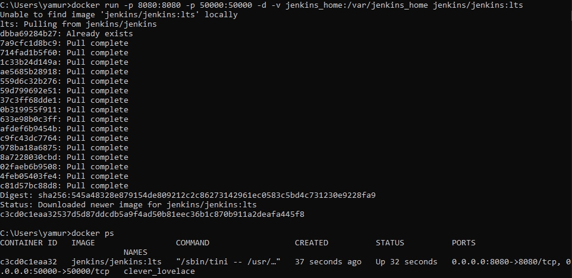
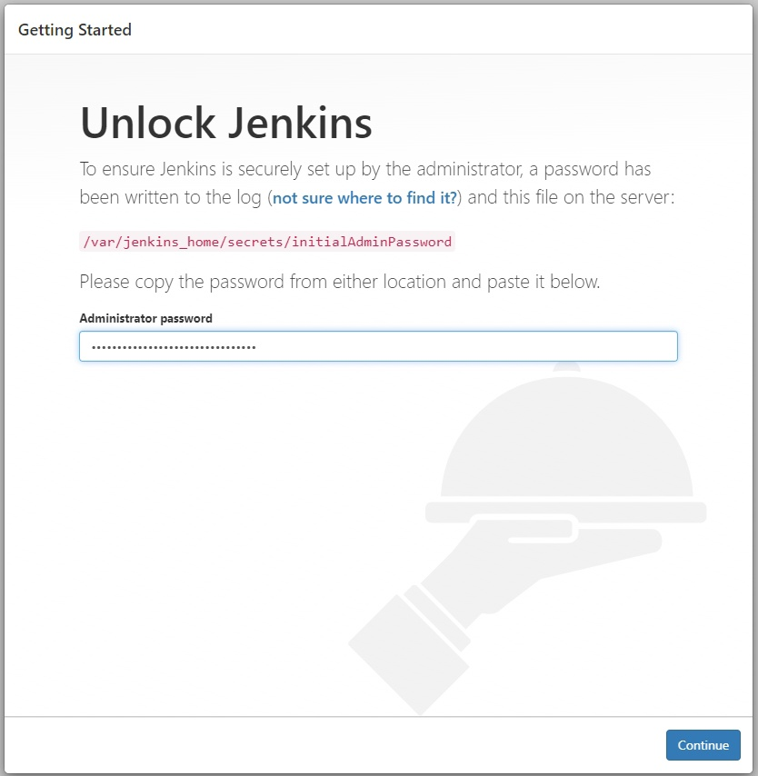

Документация для решения задачи Middle №3
====

Условия задачи:
----
1. Поднять у себя на машине Jenkins (Docker)
2. Установить плагин для работы с pipeline (по необходимости)
3. Написать pipeline, который
    a. Выводит сообщение “Начало пайплайна” в шаге с названием “Prepare”<br>
    b. Запускает параллельно два шага
        i. Шаг “Parallel1”, который выводит сообщение “Parallel work 1”<br>
        ii. Шаг “Parallel2”, который выводит сообщение “Parallel work 2”
    c. После выполнения параллельных шагов запускается шаг “End”, который выводит сообщение “End”
4. Приложить к решению скрины
    a. Шаги поднятия Jenkins<br>
    b. Сборки в Jenkins<br>
    c. Jenkinsfile


Для решения задачи использовались:
----
_Docker_ и _Браузер_

Выполнение работы
----
1. Установка Jenkins и запуск его на Docker


<br>
2. Переход в браузер по ссылке __"http://localhost:8080/"__

<br>
3. Создание pipeline

<br>
4. Написание кода 
```
pipeline {
    agent any

    stages {
        stage('Prepare') {
            steps('Prepare') {
                echo 'Начало пайплайна'
            }
        }
        stage('Parallel') {
            parallel{
                stage('Parallel1') {
                    steps('Parallel1') {
                        echo 'Parallel work 1'
                    }
                }
                stage('Parallel2') {
                    steps('Parallel2') {
                        echo 'Parallel work 2'
                    }
                }
            }
        }
    }
    post('End') { 
        always { 
            echo 'End'
        }
    }
}
```
5. Запуск pipeline

<br>
6. Выходные данные
    a. <br>
    b. <br>
        i. <br>
        ii. <br>
    c. 